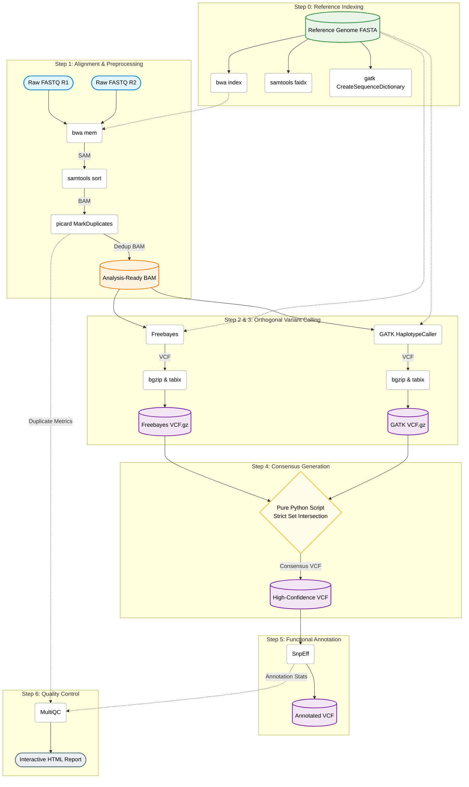

# High-Confidence Variant Calling Pipeline

A robust, reproducible, and scalable Snakemake pipeline designed to identify high-confidence single nucleotide polymorphisms (SNPs) and short insertions/deletions (indels) from short-read sequencing data.

To drastically reduce false-positive rates, this pipeline utilizes an orthogonal calling strategy. It runs both local de-novo assembly (GATK HaplotypeCaller) and Bayesian haplotype-based calling (Freebayes), intersecting the results via a custom Python implementation to produce a highly accurate consensus variant set.

🧬 **Pipeline Architecture**




**Features**

Fully Automated: Managed end-to-end by Snakemake.

Reproducible Environments: Tool dependencies are strictly isolated using Conda/Mamba environments (envs/).

Orthogonal Validation: Cross-references GATK and Freebayes to eliminate caller-specific artifacts.

Robust Merging: Uses a native Python set-intersection script to bypass common bcftools merge segmentation faults caused by differing VCF header types.

Comprehensive QC: Aggregates mapping, duplication, and annotation metrics into a single interactive MultiQC report.

**Prerequisites**

You will need Conda (preferably mamba for much faster environment solving) and Snakemake installed on your system.

**Install Mamba (if not already installed)**
```conda install -n base -c conda-forge mamba```

**Install Snakemake**
```mamba create -c conda-forge -c bioconda -n snakemake snakemake```


**Usage**

1. Clone the Repository & Setup Directory

```git clone https://github.com/YourUsername/VariantCallingPipeline.git```

```cd VariantCallingPipeline```


Ensure your directory structure looks like this:

```
VariantCallingPipeline/
├── Snakefile
├── envs/
│   ├── mapping.yaml
│   ├── calling.yaml
│   └── qc.yaml
├── data/               <-- Place your raw .fastq.gz files here
└── reference/          <-- Place your genome.fa file here
```

2. Configure the Pipeline

Open the Snakefile in a text editor and update the inputs at the top of the file:

**Update with your actual sample names**

```SAMPLES = ["Patient1", "Patient2", "Control1"]``` 

**Point to your reference genome**
```REF = "reference/hg38.fa"```

**Specify the SnpEff database for your organism**
```SNPEFF_DB = "GRCh38.105"``` 


Note: Make sure to download your SnpEff database before running the pipeline on real data:

```conda activate qc -> snpEff download GRCh38.105```

3. Execution

Activate your Snakemake environment and run the pipeline.

Dry Run (Highly Recommended):
This will build the DAG and show you exactly what will be executed without actually running anything.

``conda activate snakemake
snakemake -n``


**Full Production Run:**
Run the pipeline, allowing it to use all available cores. We recommend running this inside a tmux or screen session on your Linux server.

```snakemake --use-conda --conda-frontend mamba --cores all```


**Key Output**

Upon successful completion, the results/ directory will contain:

```results/{sample}_consensus/consensus.vcf```: The raw, unannotated high-confidence variants agreed upon by both callers.

```results/{sample}.annotated.vcf```: The consensus VCF enriched with biological impact predictions (missense, frameshift, etc.).

```results/multiqc_report.html```: A beautiful, interactive dashboard summarizing sequence quality, duplication rates, and variant impacts across all your samples.
